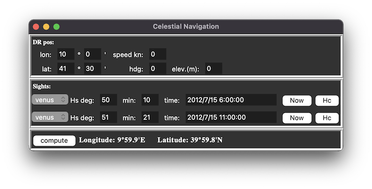

# Celestial Navigation

## Installation Linux / macOS

Requires [Python 3](https://www.python.org) and [tkinter](https://docs.python.org/3/library/tkinter.html).

Install the [PyEphem](https://rhodesmill.org/pyephem/) package:

```shell
pip3 install ephem
```

Run with:

```shell
python3 daycelestial.py
```

## Example

Press `Cmd ⌘` + `e` to fill the form with test values.


